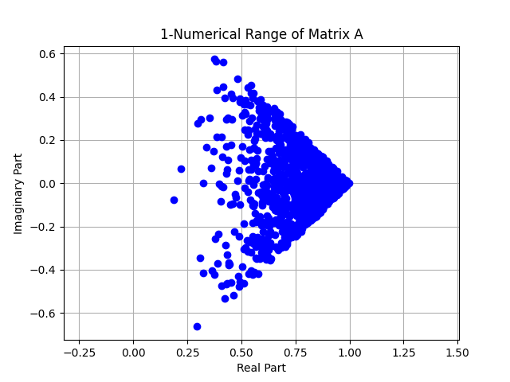

# The $k$-Numerical Range
An algorithm for computing the k-numerical range for any given matrix.

## 🔍 What is the $k$-Numerical Range?

The $k$-numerical range, $W_k(A)$, is a generalization of the classical numerical range. Instead of computing a single value $x^*Ax$ for a unit vector $x$, this version averages over $k$ orthonormal vectors:
```math
W_k(A) = \left\{ \frac{1}{k} \sum_{i=1}^{k} x_i^* A x_i \ : \ x_i \text{ orthonormal} \right\}
```
This set is always:
- Convex (e.g., may appear as shapes like squares, circles, or triangles),
- Compact (Closed and Bounded),
- Useful in matrix theory and applications involving averages of eigenvalues.

## 🧠 How the Algorithm Works

To trace the boundary of $W_k(A)$, the algorithm:
1. **Rotates** the matrix by an angle $\theta$,
2. **Takes the real part** of the rotated matrix,
3. **Finds the top $k$ eigenvectors** with the largest eigenvalues,
4. **Averages** the values $x_j^* A x_j$ for those $k$ vectors,
5. **Repeats** for many angles to trace the boundary.

This approach generalizes a known method (Carl Cowen’s) for the classical case $k = 1$.

## 📁 Files

- `AllKValues.py`: The core Python script for computing and plotting the $k$-numerical range.
- `Senior_Project_Poster.pdf`: Visual summary of the algorithm and examples, suitable for presentations.

## ✅ Requirements

This project uses:
- `numpy`
- `matplotlib`

Install them with:

```bash
pip install numpy matplotlib
```

## 🖼️ Sample Output

The script includes several plotted examples of the $k$-numerical range for different matrices, demonstrating how the shape evolves as $k$ changes.

```math
A_1 =  \begin{bmatrix}
    1 & 0 & 0 & 0 & 0 \\
    0 & \omega & 0 & 0 & 0 \\
    0 & 0 & \omega^2 & 0 & 0 \\
    0 & 0 & 0 & 0 & 1 \\
    0 & 0 & 0 & 0 & 0
   \end{bmatrix}
```