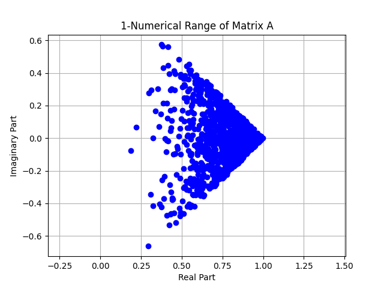
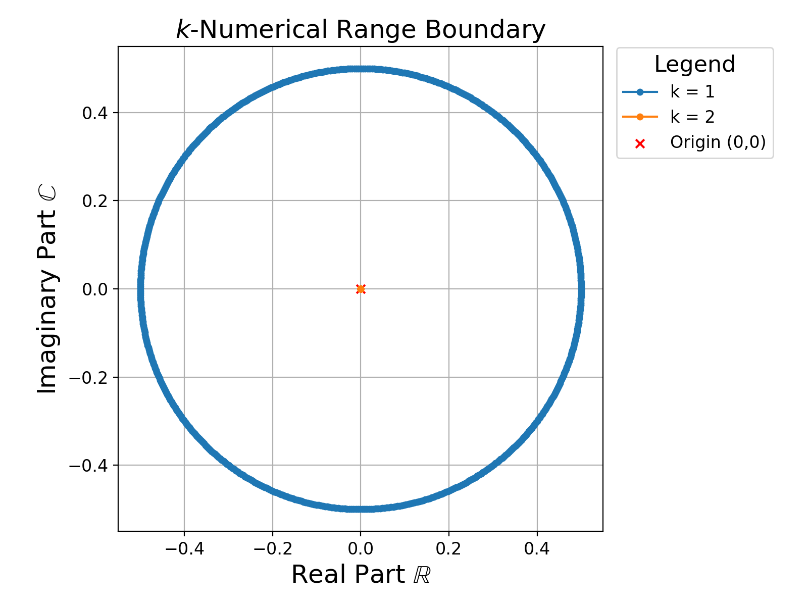
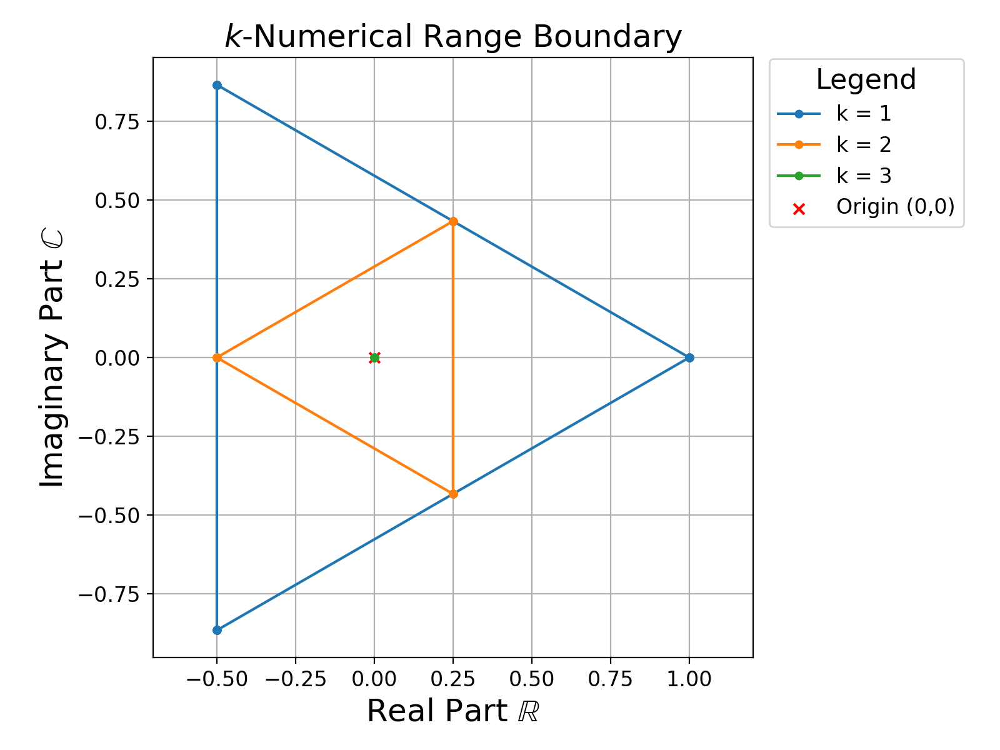
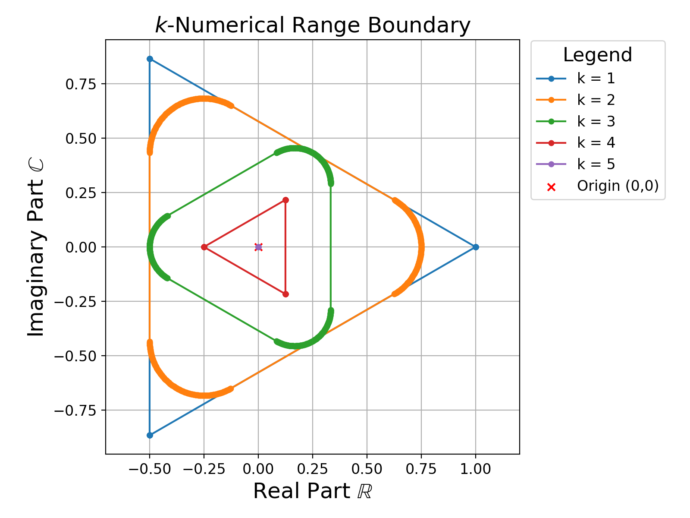
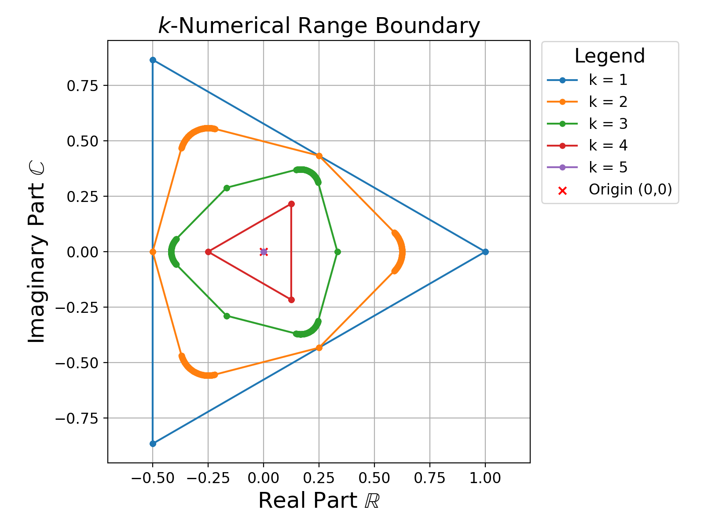
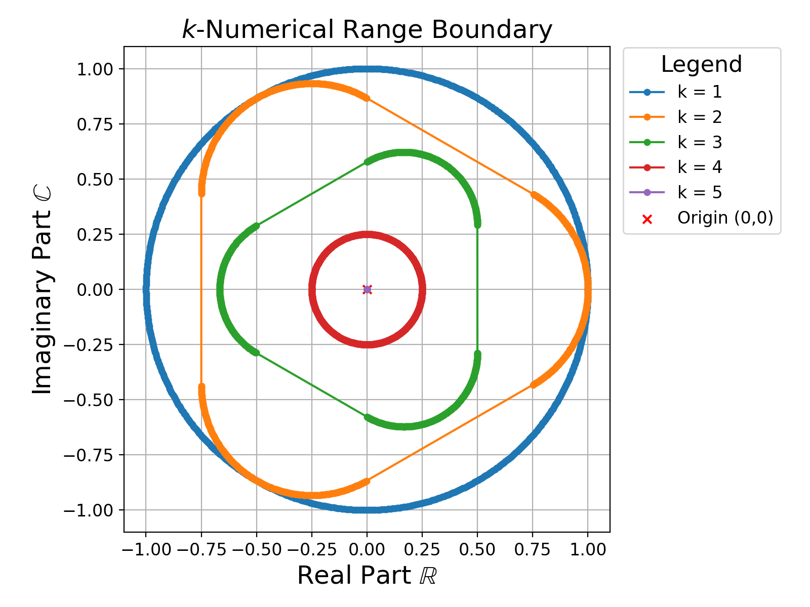

## 📃 Table of Contents
- [About](#-what-is-the--numerical-range)
- [How it Works](#-how-the-algorithm-works)
- [Files](#-files)
- [Requirements](#-requirements)
- [Example Outputs](#️-example-outputs)
    - [Matrix $A_0$](#matrix)
    - [Matrix $A_1$](#matrix-1)
    - [Matrix $A_2$](#matrix-2)
    - [Matrix $A_3$](#matrix-3)
    - [Matrix $A_4$](#matrix-4)
    - [Matrix $A_5$](#matrix-5)

## 📐 What is the $k$-Numerical Range?

To understand the $k$-numerical range, we must discuss the numerical range. The numerical range is defined as $W(A)$ for a Matrix $A$ of dimension $N$, also known as $n \times n$. It has 8 defined properties which can be found here on <a href="https://numericalshadow.org/numerical-range/properties/" target="_blank" rel="noopener noreferrer">Numericalshadow's website</a>. We will cover the basic ones here,

1. $W(A)$ is a compact subset of $\mathbb{C}$.
    - It contains the imaginary numbers set, for which $i$ is defined as: $i = \sqrt{-1}$.
2. $W(A)$ is convex as shown in the Hausdorff-Toeplitz theorem.
    - Shapes that allow **line segments** to form outside of the shape, are not convex.
3. 


The $k$-numerical range, $W_k(A)$, is a generalization of the classical numerical range. Instead of computing a single value $x^*Ax$ for a unit vector $x$, this version averages over $k$ orthonormal vectors:

$$W_k(A) = \left\{ \frac{1}{k} \sum_{i=1}^{k} x_i^* A x_i \ : \ x_i \text{ orthonormal} \right\}$$


This set is always:
- Convex (e.g., may appear as shapes like squares, circles, or triangles),
- Compact (Closed and Bounded),
- Useful in matrix theory and applications involving averages of eigenvalues.

## ⚡ How the Algorithm Works
An algorithm for computing the k-numerical range for any given matrix.

To trace the boundary of $W_k(A)$, the algorithm:
1. **Rotates** the matrix by an angle $\theta$,
2. **Takes the real part** of the rotated matrix,
3. **Finds the top $k$ eigenvectors** with the largest eigenvalues,
4. **Averages** the values $x_j^* A x_j$ for those $k$ vectors,
5. **Repeats** for many angles to trace the boundary.

This approach generalizes a known method (Carl Cowen’s) for the classical case $k = 1$.

## 📁 Files

- `AllKValues.py`: The core Python script for computing and plotting the $k$-numerical range.
- `Senior_Project_Poster.pdf`: Visual summary of the algorithm and examples, suitable for presentations.

## 📜 Requirements

This project uses:
- `numpy`
- `matplotlib`

Install them with:

```bash
pip install numpy matplotlib
```

## 🖼️ Example Outputs

The list of outputs includes several plotted examples of the $k$-numerical range for different matrices. It demonstrates how the shape of the matrix evolves when iterating through $k$.

Matrix $A_0$ is my first version of the $k$-numerical range in Python. This naive method primarily used NumPy’s trace function to compute the approximation, with a structure like:

```python
approx = np.trace(X.conj().T @ A @ X) / k
```

### Matrix $A_0$
<div align="center">
    
</div>

$$A_0 = \begin{bmatrix}
i & 0 & 0 & \cdots & 0 \\
0 & -i & 0 & \cdots & 0 \\
0 & 0 & 1 & \cdots & 0 \\
\vdots & \vdots & \vdots & \ddots & \vdots \\
0 & 0 & 0 & \cdots & 1
\end{bmatrix} \in M_7(\mathbb{C})$$

This naive method was not well-suited for accurately tracing the boundary of the $k$-numerical range. Instead, it generated points from the interior of $W_k(A)$ by averaging over randomly chosen subspaces.

---

### Matrix $A_1$

Starting of simple, we have matrix $A_1$, with a dimension of $n = 2$,

$$
A = \begin{bmatrix}
    0 & 1 \\
    0 & 0
    \end{bmatrix}
$$

Using the **algorithm**,

<div align="center">
    
</div>

We end up getting a nice circle for $k = 1$, then $k = 2$ collapses to a singular dot since $k$ is now the same size as the dimension $n = 2$ of Matrix $A_1$.

---

### Matrix $A_2$

For Matrix $A_2$, let the dimension be $n = 3$,

then set $\omega$ equal to, 

$$\omega = \frac{-1+i\sqrt{3}}{2}$$

Now,

$$
A = \begin{bmatrix}
    1 & 0 & 0 \\
    0 & \omega & 0 \\
    0 & 0 & \omega^2
    \end{bmatrix}
$$

Running $A_2$ through the **algorithm**,

<div align="center">
    
</div>

This result gave us a triangle for $k = 1$. As for $k = 2$, it shows a flipped triangle inside of $k = 1$. Finally, for $k = 3$, it collapses like $A_1$ because the dimensions become equal to each other $k = n = 3$.

---

### Matrix $A_3$

Let $\omega$ equal,

Then let Matrix $A_3$ have a dimension of $n = 5$, then we combine both Matrices $A_1$ and $A_2$. Matrix $A_2$ is in the upper left and and $A_1$ is in the lower right. Which leaves us with,

$$A_1 = \begin{bmatrix}
    1 & 0 & 0 & 0 & 0 \\
    0 & \omega & 0 & 0 & 0 \\
    0 & 0 & \omega^2 & 0 & 0 \\
    0 & 0 & 0 & 0 & 1 \\
    0 & 0 & 0 & 0 & 0
   \end{bmatrix}$$

Using the $k$-numerical range **algorithm** we get,

<div align="center">
    
</div>

**Iteration of $k$**
- When $k = 1$, it traces the boundary to reveal a triangle.
- Then $k = 2$, it takes the average of the circle shape within the matrix to give the triangle curved points.
- Looking at $k = 3$, we can see that it is $k = 2$ but flipped and on the inside.
- $k = 4$ shows the same triangle from $k = 1$ but again flipped and inside $k = 3$
- Finally $k = 5$ is a singluar point since the iteration of $k$ has reach the same size of the matrix $n = 5$.

---

### Matrix $A_4$
Modifying $A_1$ by changing $1$ to $\frac{1}{2}$, we get $A_2$,

$$A_1 = \begin{bmatrix}
    1 & 0 & 0 & 0 & 0 \\
    0 & \omega & 0 & 0 & 0 \\
    0 & 0 & \omega^2 & 0 & 0 \\
    0 & 0 & 0 & 0 & 1 \\
    0 & 0 & 0 & 0 & 0
    \end{bmatrix}

\quad \implies \quad

A_2 = \begin{bmatrix}
    1 & 0 & 0 & 0 & 0 \\
    0 & \omega & 0 & 0 & 0 \\
    0 & 0 & \omega^2 & 0 & 0 \\
    0 & 0 & 0 & 0 & \frac{1}{2} \\
    0 & 0 & 0 & 0 & 0
   \end{bmatrix}$$

<div align="center">
    
</div>

---

### Matrix $A_5$
Lastly by changing matrix $A_1$ again, we make $1$ become a $2$, which gives $A_3$,

$$A_1 = \begin{bmatrix}
    1 & 0 & 0 & 0 & 0 \\
    0 & \omega & 0 & 0 & 0 \\
    0 & 0 & \omega^2 & 0 & 0 \\
    0 & 0 & 0 & 0 & 1 \\
    0 & 0 & 0 & 0 & 0
    \end{bmatrix}

\quad \implies \quad

A_3 = \begin{bmatrix}
    1 & 0 & 0 & 0 & 0 \\
    0 & \omega & 0 & 0 & 0 \\
    0 & 0 & \omega^2 & 0 & 0 \\
    0 & 0 & 0 & 0 & 2 \\
    0 & 0 & 0 & 0 & 0
   \end{bmatrix}$$

<div align="center">
    
</div>

---